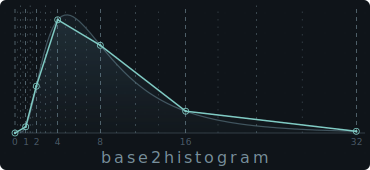

# base2histogram



`base2histogram` is a 2 KB histogram that tracks any `u64` distribution and
answers percentile queries (P50, P99, P99.9, …) with under 2% error for
typical latency workloads.

- **Near-zero error for API latency tracking** — log-normal distributions
  (typical for API/service latency) achieve **< 0.3% error at P50/P95/P99**
  with just 2 KB (default WIDTH=3, 252 buckets):
  ```text
  LN-API  P50  0.000%     P95  0.160%     P99  0.228%
  ```
- **`O(1)` recording**, fixed memory — no sorting, no resizing, suitable for
  hot paths.
- **Full `u64` range** — from nanoseconds to hours in a single histogram.
- **Sliding-window** aggregation via multi-slot mode.

## Usage

```rust
use base2histogram::Histogram;

let mut hist = Histogram::<()>::new();

hist.record(5);
hist.record(8);
hist.record(13);
hist.record_n(21, 3);

assert_eq!(hist.total(), 6);
assert_eq!(hist.percentile(0.50), 13);
assert_eq!(hist.percentile(0.99), 23);
```

## Sliding Window

Use `with_slots()` plus `advance()` when metrics should be aggregated over a
bounded set of recent windows:

```rust
use base2histogram::Histogram;

let mut hist = Histogram::<&'static str>::with_slots(2);

hist.record_n(10, 2);
hist.advance("warm");
hist.record_n(100, 3);

assert_eq!(hist.total(), 5);

hist.advance("steady");

// The oldest slot is evicted once the slot limit is reached.
assert_eq!(hist.total(), 3);
```

## Common Stats

```rust
use base2histogram::Histogram;

let mut hist = Histogram::<()>::new();
hist.record_n(20, 80);
hist.record_n(80, 20);

let stats = hist.percentile_stats();

assert_eq!(stats.samples, 100);
assert_eq!(stats.p50, 21);
assert_eq!(stats.p90, 87);
```

## Percentile Accuracy

**Trapezoidal interpolation** vs returning bucket midpoint (log-normal API latency, WIDTH=3, 1M samples):

| Method | P50 | P95 | P99 |
|--------|-----|-----|-----|
| midpoint | 5.018% | 7.732% | 4.861% |
| trapezoidal | 0.000% | 0.080% | 0.086% |

The interpolation estimates a density gradient from neighbor buckets and solves the inverse CDF — no extra storage needed.

The `WIDTH` parameter controls bucket granularity: each bucket group uses
`WIDTH` bits, giving `2^(WIDTH-1)` buckets per group. Higher `WIDTH` means
finer resolution but more memory. The default is `WIDTH=3` (252 buckets).

Measured with 1,000,000 samples per distribution (`cargo run --bin accuracy`).
Error = `|exact - estimated| / exact × 100%`, shown at P50 / P95 / P99:

```text
                        W=1        W=2        W=3        W=4        W=5        W=6
  --------------------------------------------------------------------------------
  Uniform P50        0.105%     0.028%     0.012%     0.018%     0.019%     0.002%
          P95        3.058%     2.551%     1.078%     0.292%     0.005%     0.005%
          P99        4.473%     4.315%     3.744%     0.991%     0.306%     0.089%

  LN-API  P50        2.007%     0.274%     0.000%     0.000%     0.000%     0.000%
          P95        0.200%     0.480%     0.160%     0.080%     0.040%     0.000%
          P99       14.860%     1.398%     0.228%     0.000%     0.029%     0.029%

  Bimodal P50        2.170%     0.592%     0.197%     0.197%     0.000%     0.000%
          P95        1.181%     0.378%     0.032%     0.032%     0.038%     0.008%
          P99        1.965%     1.733%     0.434%     0.045%     0.014%     0.013%

  Expon   P50        0.723%     0.000%     0.000%     0.000%     0.000%     0.000%
          P95        0.932%     0.233%     0.067%     0.000%     0.033%     0.000%
          P99        1.322%     0.087%     0.108%     0.022%     0.022%     0.022%

  LN-DB   P50        1.413%     0.034%     0.034%     0.000%     0.000%     0.000%
          P95        2.976%     0.329%     0.006%     0.000%     0.019%     0.019%
          P99       11.718%     0.502%     0.066%     0.007%     0.003%     0.062%

  Sequent P50        0.092%     0.000%     0.000%     0.000%     0.000%     0.000%
          P95        3.013%     2.539%     1.054%     0.316%     0.000%     0.000%
          P99        4.455%     4.305%     3.732%     1.026%     0.315%     0.093%

  Pareto  P50       10.127%     0.633%     0.000%     0.000%     0.000%     0.000%
          P95        5.027%     0.815%     0.136%     0.000%     0.000%     0.000%
          P99        0.046%     0.185%     0.093%     0.093%     0.000%     0.000%

  --------------------------------------------------------------------------------
  Buckets                65        128        252        496        976       1920
  Mem/slot            520 B     1.0 KB     2.0 KB     3.9 KB     7.6 KB    15.0 KB
  Mem total          1.0 KB     2.0 KB     3.9 KB     7.8 KB    15.2 KB    30.0 KB
  --------------------------------------------------------------------------------
```

Distributions: Uniform [0, 1M], Log-normal API latency (σ=0.5),
Bimodal cache hit/miss (90/10), Exponential IO wait, Log-normal DB query
(σ=1.0), Sequential [1..N], Pareto heavy tail (α=1.5).

## Algorithm

See [Algorithm](docs/algorithm.md) for a detailed description of the float-like bucket encoding, trapezoidal interpolation, and error bound analysis.

## Comparison Notes

- [base2histogram vs Heistogram](docs/base2histogram-vs-heistogram.md)
- [base2histogram vs H2 Histogram](docs/base2histogram-vs-h2histogram.md)

## License

Licensed under Apache-2.0. See [LICENSE](./LICENSE).
